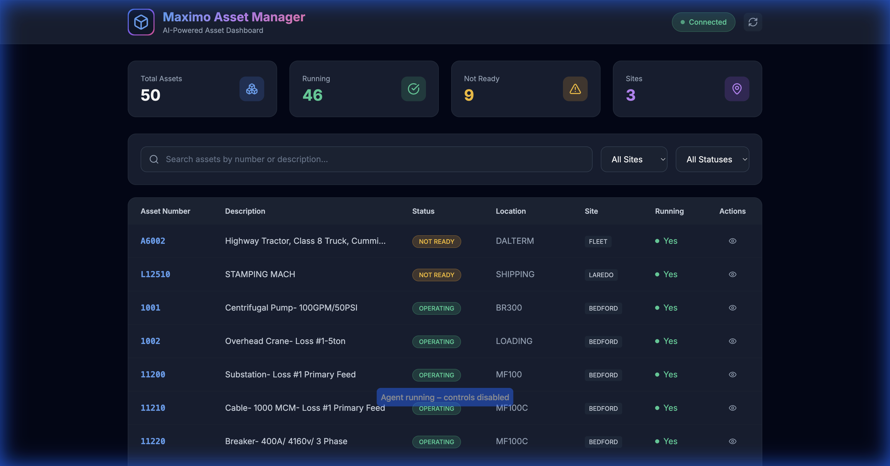
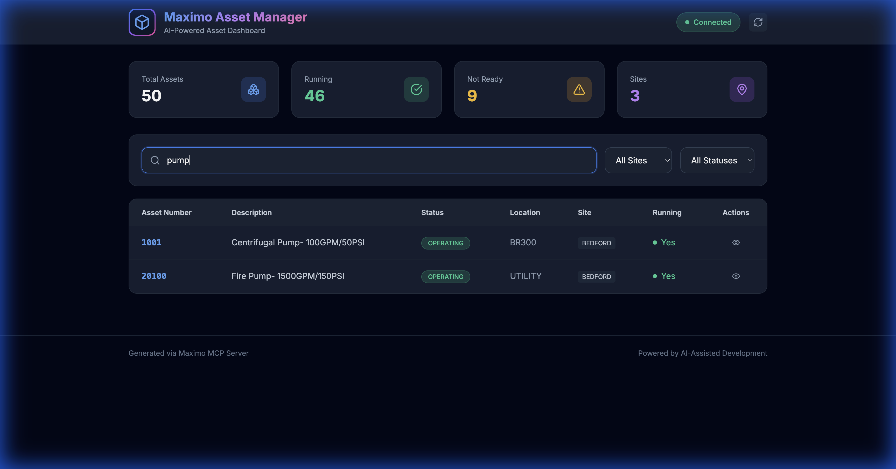
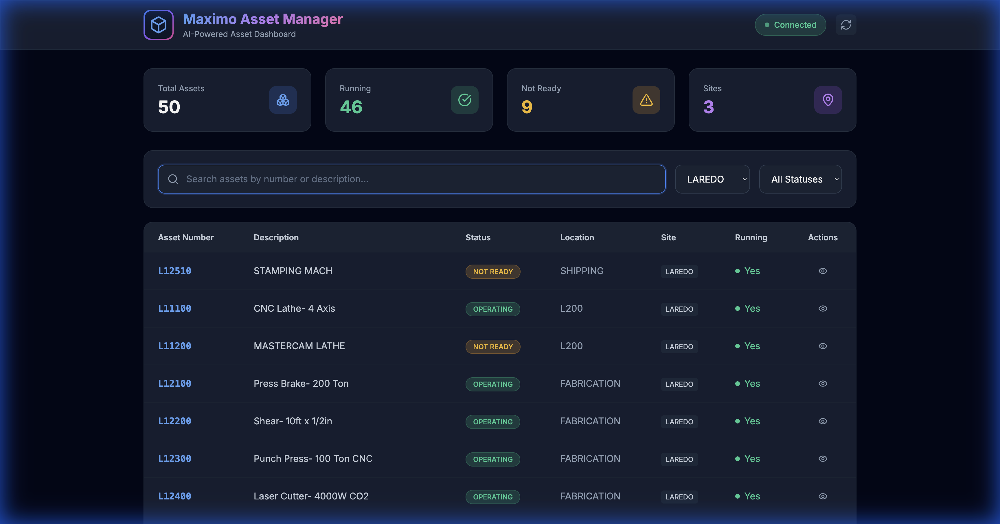
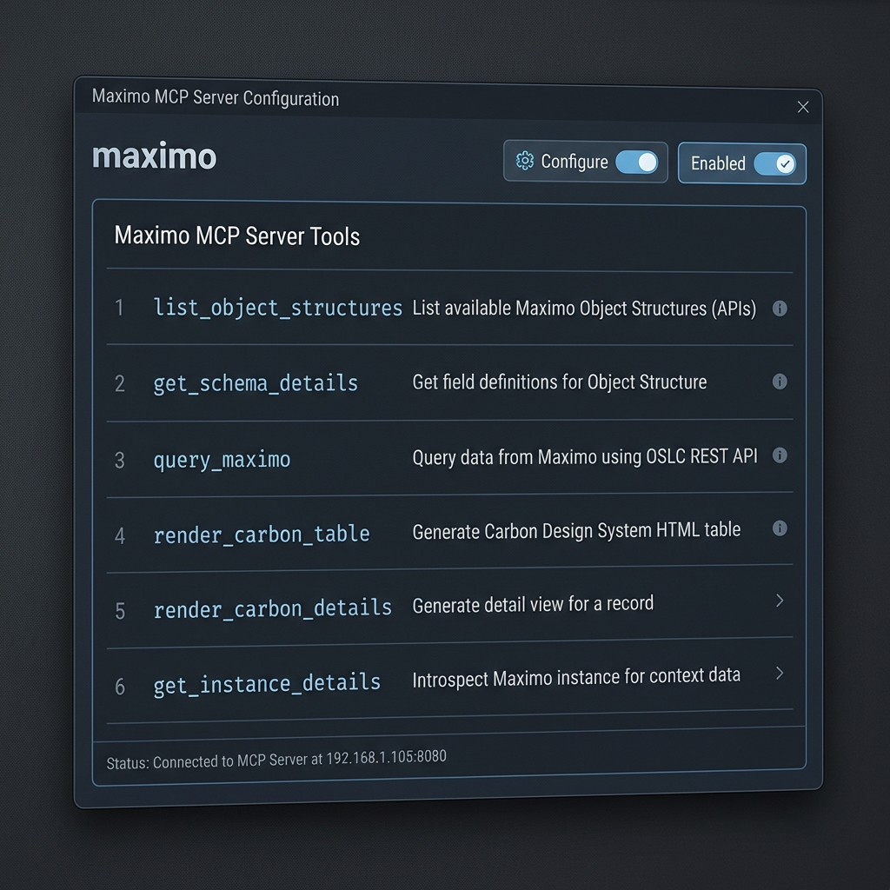

<div align="center">

# 🏭 Maximo MCP Server

### AI-Powered Development for IBM Maximo

[](https://nodejs.org/)
[](https://modelcontextprotocol.io/)
[](https://www.ibm.com/products/maximo)
[](LICENSE)

*Transform your Maximo development workflow with AI-driven schema discovery, live data querying, and intelligent code generation.*

**Author:** Markus van Kempen  
**Email:** mvankempen@ca.ibm.com | markus.van.kempen@gmail.com  
**Date:** 3 February 2026

[Getting Started](#-quick-start) • [Documentation](#-documentation) • [Live Demo](#-live-demo) • [Use Cases](#-use-cases)

</div>

---

## 🎯 What is This?

The **Maximo MCP Server** is a [Model Context Protocol](https://modelcontextprotocol.io/) server that connects AI assistants (like Antigravity, Cursor, or VS Code Copilot) directly to your IBM Maximo environment. Instead of manually copying API documentation, the AI can:

| Capability | Description |
|------------|-------------|
| 🔍 **Discover APIs** | Find available Object Structures (MXWO, MXASSET, etc.) |
| 📋 **Inspect Schemas** | Get exact field names, types, and descriptions |
| 📊 **Query Live Data** | Execute OSLC REST queries and see real results |
| 🎨 **Generate UI** | Create Carbon Design System tables and dashboards |
| ✅ **Validate Instantly** | Test queries before generating final code |

---

## 📚 Documentation

### Core Guides

| Document | Description |
|----------|-------------|
| 📖 [**Maximo MCP Server Guide**](docs/Maximo_MCP_Server_Guide.md) | Complete setup, configuration, and tool reference |
| 🔌 [**Maximo API Interaction Guide**](docs/Maximo_API_Interaction_Guide.md) | OSLC query syntax, code generation patterns, troubleshooting |
| 🎬 [**Asset Manager Case Study**](docs/Asset_Manager_App_Case_Study.md) | Step-by-step walkthrough of building a complete app |

### French Translations

| Document | Description |
|----------|-------------|
| 📖 [Guide du Serveur MCP Maximo](docs/Maximo_MCP_Server_Guide_FR.md) | Version française du guide complet |
| 🔌 [Guide d'Interaction API Maximo](docs/Maximo_API_Interaction_Guide_FR.md) | Version française du guide API |

### Word Documents

All guides are also available in `.docx` format in the `docs/` folder for offline reading and sharing.

---

## ⚡ Quick Start

### Prerequisites

- **Node.js** v18 or higher
- **Maximo API Key** with read access
- AI IDE with MCP support (Antigravity, Cursor, VS Code + Continue)

### Installation

```bash
# Clone the repository
git clone https://github.com/your-org/Maximo-MCP-EDF.git
cd Maximo-MCP-EDF

# Install dependencies
npm install

# Set up environment variables
cp .env.example .env
# Edit .env with your Maximo credentials
```

### Environment Configuration

Edit the `.env` file with your Maximo credentials:

```bash
# .env (never commit this file!)
MAXIMO_URL=https://your-maximo-host.com/maximo/api
MAXIMO_HOST=https://your-maximo-host.com
MAXIMO_API_KEY=your-api-key-here
MAXIMO_OPENAPI_PATH=./maximo_openapi.json
PORT=3002
```

### Download the OpenAPI Schema (Recommended)

The OpenAPI schema file enables offline schema lookups for faster AI responses:

```bash
# Download from your Maximo instance
curl -X GET "https://your-maximo-host.com/maximo/oslc/oas/api" \
     -H "apikey:your-api-key-here" \
     -o maximo_openapi.json
```

Alternatively, download via Swagger UI at: `https://your-host/maximo/oslc/oas/api.html`

> **Note**: This file is ~12MB and contains all Object Structure definitions for your Maximo instance.

### IDE Configuration

Copy and configure the MCP settings for your IDE:

**For Cursor:**
```bash
cp config/mcp_config.json.example ~/.cursor/mcp.json
```

**For Antigravity:**
```bash
mkdir -p .gemini && cp config/mcp_config.json.example .gemini/settings.json
```

Edit the config file and update the path to `maximo-mcp-server.js`:

```json
{
  "mcpServers": {
    "maximo": {
      "command": "node",
      "args": ["/absolute/path/to/maximo-mcp-server.js"],
      "env": {
        "MAXIMO_URL": "https://your-maximo-host/maximo/api",
        "MAXIMO_API_KEY": "your-api-key-here"
      }
    }
  }
}
```

### Verify Connection

In your AI IDE, ask:
> "Is the Maximo MCP server connected?"

The AI will call `get_instance_details` and confirm connectivity.

---

## 🎬 Live Demo

### Asset Manager Application

We built a complete **Maximo Asset Manager** web application using only natural language prompts and the MCP server.

<div align="center">



*50 assets loaded with real-time filtering and search*

</div>

#### Demo Features

| Feature | Screenshot |
|---------|------------|
| **Full Dashboard** | 50 assets, 4 stat cards, 3 sites |
| **Search Filter** |  |
| **Site Filter** |  |

#### 🎥 Screen Recording

A complete video demonstration is available: [`assets_demo_recording.webp`](images/assets_demo_recording.webp)

#### Try It Yourself

```bash
# Start the local proxy server
node server.js

# Open in browser
open http://localhost:3002/demos/assets.html
```

---

## 🛠 Available MCP Tools

The server exposes 6 tools to the AI:



| Tool Name | Description |
| :--- | :--- |
| `list_object_structures` | List available Maximo Object Structures (APIs) |
| `get_schema_details` | Get field definitions for an Object Structure |
| `query_maximo` | Execute OSLC REST queries |
| `render_carbon_table` | Generate Carbon Design HTML tables |
| `render_carbon_details` | Generate detail view for a record |
| `get_instance_details` | Check server connectivity |

---

## 💡 Use Cases

### 1. Generate API Calls
> "Get me the last 10 approved work orders from BEDFORD site"

The AI calls `get_schema_details(MXWO)`, understands the fields, and generates:

```http
GET /maximo/api/os/mxwo
    ?oslc.where=status="APPR" and siteid="BEDFORD"
    &oslc.select=wonum,description,status,reportdate
    &oslc.orderBy=-reportdate
    &oslc.pageSize=10
    &lean=1
```

### 2. Generate Python Scripts
> "Write a Python script to export all Priority 1 work orders to CSV"

```python
import requests
import csv

response = requests.get(
    "https://your-host/maximo/api/os/mxwo",
    params={"oslc.where": "wopriority=1", "lean": 1},
    headers={"apikey": "YOUR_KEY"}
)

with open("priority1_workorders.csv", "w") as f:
    writer = csv.DictWriter(f, fieldnames=["wonum", "description"])
    writer.writeheader()
    writer.writerows(response.json()["member"])
```

### 3. Generate SQL Queries
> "Write SQL to find overdue work orders"

```sql
SELECT wonum, description, status, targcompdate
FROM workorder
WHERE status NOT IN ('COMP', 'CLOSE', 'CAN')
  AND targcompdate < CURRENT_DATE;
```

### 4. Build Complete Applications
> "Create an HTML dashboard to display assets"

**Result:** A complete web application with:
- Dark theme with glassmorphism
- Search and filter functionality
- Interactive detail panels
- Pre-loaded data from Maximo

See the [Asset Manager Case Study](docs/Asset_Manager_App_Case_Study.md) for the full walkthrough.

---

## 📁 Project Structure

```
Maximo-MCP-EDF/
├── maximo-mcp-server.js       # 🔌 MCP Server implementation
├── server.js                  # 🌐 Local proxy server for CORS
├── package.json               # 📦 Dependencies
├── README.md                  # This file
├── .env.example               # Environment template
├── .gitignore                 # Git ignore rules
│
├── docs/                      # 📚 Documentation
│   ├── Maximo_MCP_Server_Guide.md         # Complete MCP guide
│   ├── Maximo_API_Interaction_Guide.md    # API interaction patterns
│   ├── Asset_Manager_App_Case_Study.md    # Build walkthrough
│   ├── Maximo_MCP_Server_Guide_FR.md      # French translation
│   └── Maximo_API_Interaction_Guide_FR.md # French translation
│
├── demos/                     # 🎨 Demo Applications
│   ├── assets.html                        # Asset Manager app
│   ├── carbon_workorders.html             # Carbon table demo
│   └── index.html                         # API visualization demo
│
├── images/                    # 📸 Screenshots & Recordings
│   ├── assets_demo_recording.webp         # Full demo recording
│   ├── assets_loaded.png                  # Dashboard screenshot
│   ├── pump_search_results.png            # Search demo
│   └── laredo_filtered.png                # Filter demo
│
└── config/                    # ⚙️ Configuration Templates
    └── mcp_config.json.example            # MCP config template
```

---

## 🔒 Security Best Practices

| Practice | Description |
|----------|-------------|
| 🔐 **Local Execution** | MCP server runs on your machine; API keys never leave your environment |
| 📖 **Read-Only Keys** | Use limited-permission API keys for development |
| 🔒 **Environment Variables** | Never hardcode credentials in config files |
| 🌐 **HTTPS Only** | Always use encrypted connections to Maximo |

---

## 🤝 Contributing

Contributions are welcome! Please read our contributing guidelines before submitting PRs.

1. Fork the repository
2. Create a feature branch (`git checkout -b feature/amazing-feature`)
3. Commit your changes (`git commit -m 'Add amazing feature'`)
4. Push to the branch (`git push origin feature/amazing-feature`)
5. Open a Pull Request

---

## 📄 License

This project is licensed under the MIT License - see the [LICENSE](LICENSE) file for details.

---

## 🙏 Acknowledgments

- [Model Context Protocol](https://modelcontextprotocol.io/) for the MCP specification
- [IBM Maximo](https://www.ibm.com/products/maximo) for the enterprise asset management platform
- [Carbon Design System](https://carbondesignsystem.com/) for the UI components

---

<div align="center">

**Built with ❤️ using AI-Assisted Development**

*Transforming enterprise development, one prompt at a time.*

</div>
