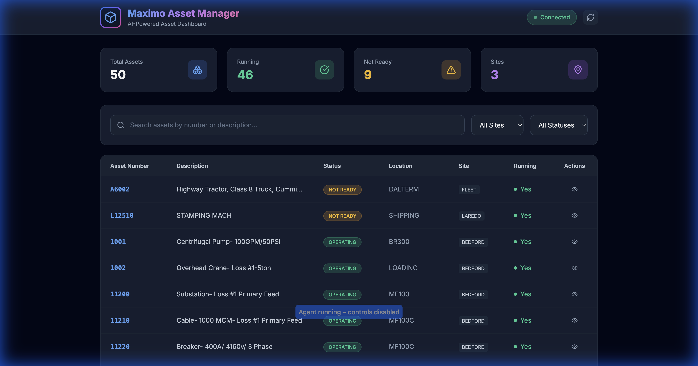
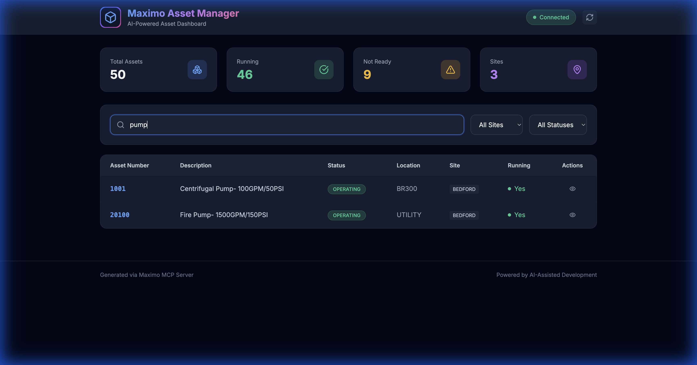
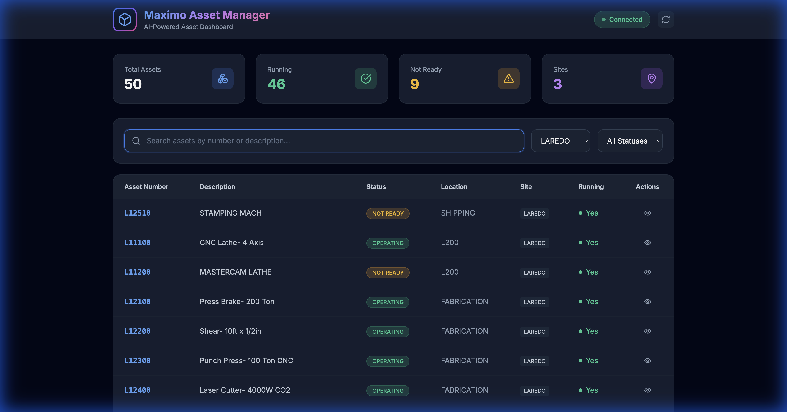
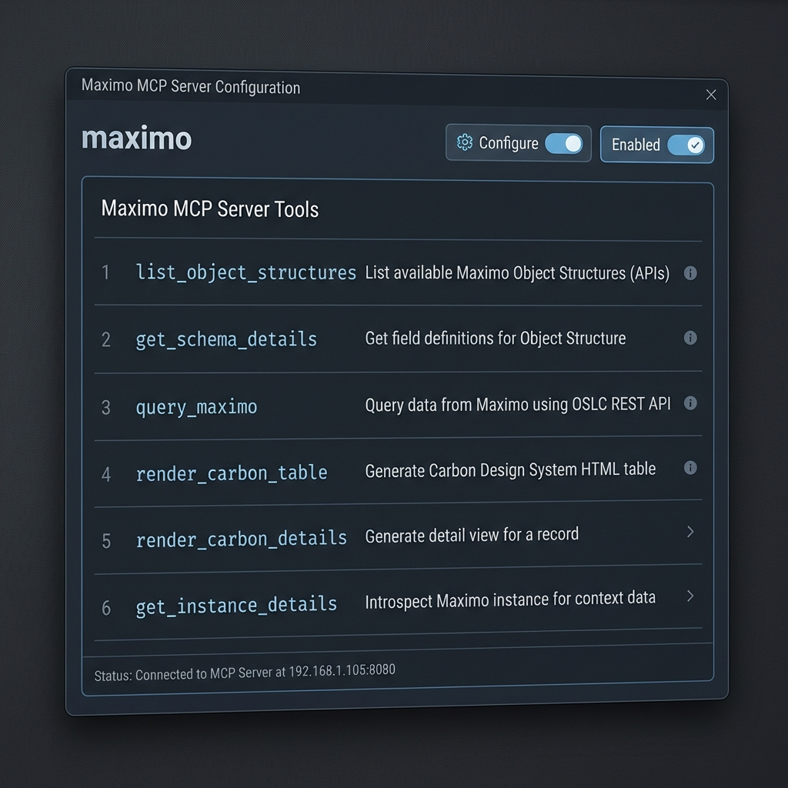

<div align="center">

# 🏭 Maximo MCP Server

### AI-Powered Development for IBM Maximo

[](https://nodejs.org/)
[](https://modelcontextprotocol.io/)
[](https://www.ibm.com/products/maximo)
[](LICENSE)
[](package.json)

*Transform your Maximo development workflow with AI-driven schema discovery, live data querying, intelligent code generation, and full write-back capabilities.*

**Author:** Markus van Kempen  
**Email:** mvankempen@ca.ibm.com | markus.van.kempen@gmail.com  
**Date:** 5 February 2026

[Getting Started](#-quick-start) • [Documentation](#-documentation) • [Live Demo](#-live-demo) • [Use Cases](#-use-cases)

</div>

---

## 🎯 What is This?

The **Maximo MCP Server** is a [Model Context Protocol](https://modelcontextprotocol.io/) server that connects AI assistants (like Antigravity, Cursor, or VS Code Copilot) directly to your IBM Maximo environment. Instead of manually copying API documentation, the AI can:

| Capability | Description |
|------------|-------------|
| 🔍 **Discover APIs** | Find available Object Structures (MXWO, MXASSET, etc.) |
| 📋 **Inspect Schemas** | Get exact field names, types, and descriptions |
| 📊 **Query Live Data** | Execute OSLC REST queries and see real results |
| 🎨 **Generate UI** | Create Carbon Design System tables and dashboards |
| ✅ **Validate Instantly** | Test queries before generating final code |
| ✏️ **Create Records** | Create Work Orders, Assets, Service Requests via AI |
| 🔄 **Update Records** | Partially update any Maximo record by ID |
| ⚡ **Run Actions** | Trigger Maximo business workflows (status changes, approvals) |

---

## 📚 Documentation

### Core Guides

| Document | Description |
|----------|-------------|
| 📖 [**Maximo MCP Server Guide**](docs/Maximo_MCP_Server_Guide.md) | Complete setup, configuration, and tool reference |
| 🔌 [**Maximo API Interaction Guide**](docs/Maximo_API_Interaction_Guide.md) | OSLC query syntax, code generation patterns, troubleshooting |
| 🎬 [**Asset Manager Case Study**](docs/Asset_Manager_App_Case_Study.md) | Step-by-step walkthrough of building a complete app |
| 🧩 [**Maximo API Explorer Guide**](docs/Maximo_API_Explorer_Guide.md) | VS Code extension: install, connect, explore, generate apps |

### French Translations

| Document | Description |
|----------|-------------|
| 📖 [Guide du Serveur MCP Maximo](docs/Maximo_MCP_Server_Guide_FR.md) | Version française du guide complet |
| 🔌 [Guide d'Interaction API Maximo](docs/Maximo_API_Interaction_Guide_FR.md) | Version française du guide API |

### Word Documents

All guides are also available in `.docx` format in the `docs/` folder for offline reading and sharing.

---

## ⚡ Quick Start

### Prerequisites

- **Node.js** v18 or higher
- **Maximo API Key** with read access
- AI IDE with MCP support (Antigravity, Cursor, VS Code + Continue)

### Installation

### Installation

**Method 1: Run directly with npx (Recommended)**

```bash
npx maximo-mcp-server
```

**Method 2: Clone from Source**

```bash
# Clone the repository
git clone https://github.com/markusvankempen/maximo-mcp-ai-integration-options.git
cd maximo-mcp-ai-integration-options

# Install dependencies
npm install

# Set up environment variables
cp .env.example .env
# Edit .env with your Maximo credentials
```

### Environment Configuration

Edit the `.env` file with your Maximo credentials:

```bash
# .env (never commit this file!)
MAXIMO_URL=https://your-maximo-host.com/maximo/api
MAXIMO_HOST=https://your-maximo-host.com
MAXIMO_API_KEY=your-api-key-here
MAXIMO_OPENAPI_PATH=./maximo_openapi.json
PORT=3002
```

### Download the OpenAPI Schema (Recommended)

The OpenAPI schema file enables offline schema lookups for faster AI responses:

```bash
# Download from your Maximo instance
curl -X GET "https://your-maximo-host.com/maximo/oslc/oas/api" \
     -H "apikey:your-api-key-here" \
     -o maximo_openapi.json
```

Alternatively, download via Swagger UI at: `https://your-host/maximo/oslc/oas/api.html` (Click "Explore" or "Download")

**Method 3: Direct Browser Download (Manual)**

If `curl` fails (e.g., due to SSL/network errors), you can manually download the file:

1. Open this URL in your browser:
   `https://[YOUR_MAXIMO_HOST]/maximo/oslc/oas/api`
   *(Replace `[YOUR_MAXIMO_HOST]` with your actual server address)*

2. You may be prompted to log in to Maximo.

3. Once the JSON loads, right-click the page and select **"Save Page As..."**.

4. Save the file as `maximo_openapi.json` in your project root folder.

> **Note**: This file is ~12MB and contains all Object Structure definitions for your Maximo instance.

### IDE Configuration

#### VS Code with GitHub Copilot (Recommended)

**Option 1: Install from the MCP Server Gallery**

1. Enable `chat.mcp.gallery.enabled` in VS Code settings
2. Open the Extensions view (`⇧⌘X`)
3. Type `@mcp maximo` in the search field
4. Click **Install** to add the Maximo MCP server

**Option 2: Add manually via `mcp.json`**

1. Open the Command Palette (`⇧⌘P`) → **MCP: Open Workspace Folder Configuration**
2. Add the following configuration:

```json
{
  "inputs": [
    {
      "type": "promptString",
      "id": "maximo-url",
      "description": "Maximo REST API Base URL (e.g., https://your-host/maximo/api)"
    },
    {
      "type": "promptString",
      "id": "maximo-api-key",
      "description": "Maximo API Key",
      "password": true
    },
    {
      "type": "promptString",
      "id": "maximo-host",
      "description": "Maximo Host URL (e.g., https://your-host)"
    }
  ],
  "servers": {
    "maximo-mcp-server": {
      "type": "stdio",
      "command": "npx",
      "args": ["-y", "maximo-mcp-server"],
      "env": {
        "MAXIMO_URL": "${input:maximo-url}",
        "MAXIMO_API_KEY": "${input:maximo-api-key}",
        "MAXIMO_HOST": "${input:maximo-host}"
      }
    }
  }
}
```

3. VS Code will prompt you for your Maximo credentials when the server starts.

> 💡 **Tip:** This project includes a `.vscode/mcp.json` file. If you clone the repo, VS Code will auto-detect the MCP server configuration.

#### Google Antigravity (Manual Setup Required)

> ⚠️ **Note:** The Antigravity MCP Store is curated and does not auto-discover servers from the registry. You must add this server manually.

1. Open Antigravity
2. Click "**...**" dropdown at the top of the Agent panel
3. Select "**MCP Servers**" → "**Manage MCP Servers**" → "**View raw config**"
4. Add to your `mcp_config.json`:

```json
{
  "mcpServers": {
    "maximo-mcp-server": {
      "command": "npx",
      "args": ["-y", "maximo-mcp-server"],
      "env": {
        "MAXIMO_URL": "https://your-maximo-host/maximo/api",
        "MAXIMO_API_KEY": "your-api-key-here",
        "MAXIMO_HOST": "https://your-maximo-host"
      }
    }
  }
}
```

5. Save and click **Refresh**

#### Cursor / Claude Desktop

```bash
# Copy the template
cp config/mcp_config.json.example ~/.cursor/mcp.json
# Or for Claude Desktop:
cp config/mcp_config.json.example ~/Library/Application\ Support/Claude/claude_desktop_config.json
```

Edit with your Maximo credentials:

```json
{
  "mcpServers": {
    "maximo-mcp-server": {
      "command": "npx",
      "args": ["-y", "maximo-mcp-server"],
      "env": {
        "MAXIMO_URL": "https://your-maximo-host/maximo/api",
        "MAXIMO_API_KEY": "your-api-key-here"
      }
    }
  }
}
```

### Verify Connection

In your AI IDE, ask:
> "Is the Maximo MCP server connected?"

The AI will call `get_instance_details` and confirm connectivity.

---

## 🎬 Live Demo

### Asset Manager Application

We built a complete **Maximo Asset Manager** web application using only natural language prompts and the MCP server.

<div align="center">



*50 assets loaded with real-time filtering and search*

</div>

#### Demo Features

| Feature | Screenshot |
|---------|------------|
| **Full Dashboard** | 50 assets, 4 stat cards, 3 sites |
| **Search Filter** |  |
| **Site Filter** |  |

#### 🎥 Screen Recording

A complete video demonstration is available: [`assets_demo_recording.webp`](images/assets_demo_recording.webp)

#### Try It Yourself

```bash
# Start the local proxy server
node server.js

# Open in browser
open http://localhost:3002/demos/assets.html
```

---

## 🛠 Available MCP Tools

The server exposes **9 tools** to the AI — 6 read tools and 3 write/CRUD tools:



### Read Tools

| Tool Name | Description |
| :--- | :--- |
| `list_object_structures` | List available Maximo Object Structures (APIs) |
| `get_schema_details` | Get field definitions for an Object Structure |
| `query_maximo` | Execute OSLC REST queries |
| `render_carbon_table` | Generate Carbon Design HTML tables |
| `render_carbon_details` | Generate detail view for a record |
| `get_instance_details` | Check server connectivity |

### Write Tools (CRUD)

> ⚠️ **Write tools modify live data.** Use a read-only API key for exploration; only enable write access for known workflows.

| Tool Name | Description |
| :--- | :--- |
| `create_record` | Create a new record in any Maximo Object Structure |
| `update_record` | Partially update fields on an existing record by ID |
| `run_action` | Execute Maximo business actions (status changes, approvals) |

---

## 💡 Use Cases

### 1. Generate API Calls
> "Get me the last 10 approved work orders from BEDFORD site"

The AI calls `get_schema_details(MXWO)`, understands the fields, and generates:

```http
GET /maximo/api/os/mxwo
    ?oslc.where=status="APPR" and siteid="BEDFORD"
    &oslc.select=wonum,description,status,reportdate
    &oslc.orderBy=-reportdate
    &oslc.pageSize=10
    &lean=1
```

### 2. Generate Python Scripts
> "Write a Python script to export all Priority 1 work orders to CSV"

```python
import requests
import csv

response = requests.get(
    "https://your-host/maximo/api/os/mxwo",
    params={"oslc.where": "wopriority=1", "lean": 1},
    headers={"apikey": "YOUR_KEY"}
)

with open("priority1_workorders.csv", "w") as f:
    writer = csv.DictWriter(f, fieldnames=["wonum", "description"])
    writer.writeheader()
    writer.writerows(response.json()["member"])
```

### 3. Generate SQL Queries
> "Write SQL to find overdue work orders"

```sql
SELECT wonum, description, status, targcompdate
FROM workorder
WHERE status NOT IN ('COMP', 'CLOSE', 'CAN')
  AND targcompdate < CURRENT_DATE;
```

### 4. Build Complete Applications
> "Create an HTML dashboard to display assets"

**Result:** A complete web application with:
- Dark theme with glassmorphism
- Search and filter functionality
- Interactive detail panels
- Pre-loaded data from Maximo

See the [Asset Manager Case Study](docs/Asset_Manager_App_Case_Study.md) for the full walkthrough.

### 5. Create & Update Records (CRUD)
> "Create a corrective maintenance work order for the BEDFORD site, priority 1, description 'Pump failure inspection'."

The AI calls `get_schema_details(MXWO)` to confirm field names, then `create_record`:

```http
POST /maximo/api/os/MXWO?lean=1
apikey: YOUR_KEY
Content-Type: application/json

{ "description": "Pump failure inspection", "siteid": "BEDFORD", "worktype": "CM", "wopriority": 1 }
```

> "Now approve work order 1025 with memo 'Reviewed and approved'."

```http
POST /maximo/api/os/MXWO/1025?action=changeStatus&lean=1
apikey: YOUR_KEY
Content-Type: application/json

{ "status": "APPR", "memo": "Reviewed and approved" }
```

See the full guide: [**Maximo MCP Server Guide — CRUD Workflows**](docs/Maximo_MCP_Server_Guide.md#65-crud-workflows-write-back-to-maximo)

---

## 🧩 VS Code Extensions

This project includes two VS Code extensions for interactive Maximo API development — **no AI agent required**.

### Maximo API Explorer

A full-featured VS Code extension for discovering, testing, and generating code for Maximo REST APIs.


*Connected to a live Maximo instance showing Object Structures (MXWO, MXSR, MXASSET, etc.) and API Endpoints.*

| Feature | Description |
|---------|-------------|
| **Sidebar Tree View** | Browse all Object Structures (MXWO, MXASSET, MXSR, etc.) with attributes, types, and relationships |
| **Interactive API Tester** | Build OSLC queries visually, send raw requests, inspect schemas — all in a WebView panel |
| **Code Snippet Generator** | Generate ready-to-use API calls in cURL, Python, JavaScript, TypeScript, and Java |
| **Carbon App Generator** | Scaffold complete Work Order Browser and Asset Manager web apps with one click |
| **Export for AI Agents** | Export schemas and docs to `.maximo/` for use with Copilot, Cursor, or any AI assistant |


*OSLC Query Builder with live JSON response (200 OK, 20 records from MXWO).*

#### Quick Start

```bash
cd maximo-api-explorer
npm install && npm run compile
# Press F5 in VS Code to launch the Extension Development Host
```

See the full guide: [**Maximo API Explorer Guide**](docs/Maximo_API_Explorer_Guide.md)

### Maximo Cursor Explorer

A fork of the API Explorer optimized for [Cursor](https://cursor.com)'s AI features:

| Feature | Description |
|---------|-------------|
| **.cursorrules Generator** | Auto-generate rules giving Cursor AI deep Maximo API knowledge |
| **AI Context Export** | Export schemas to `.cursor/context/` for use with `@file` references |
| **Prompt Templates** | Pre-built prompts for OSLC queries, CRUD services, dashboards, and more |
| **All Standard Features** | Everything from the API Explorer, plus a dedicated Cursor AI tab |

```bash
cd maximo-cursor-extension
npm install && npm run compile
# Press F5 in VS Code to launch
```

---

## 📁 Project Structure

```
Maximo-MCP/
├── maximo-mcp-server.js       # 🔌 MCP Server implementation
├── server.js                  # 🌐 Local proxy server for CORS
├── package.json               # 📦 Dependencies & scripts
├── README.md                  # This file
├── .env.example               # Environment template
│
├── docs/                      # 📚 Documentation
│   ├── Maximo_MCP_Server_Guide.md         # Complete MCP guide
│   ├── Maximo_API_Interaction_Guide.md    # API interaction patterns
│   ├── Asset_Manager_App_Case_Study.md    # Build walkthrough
│   ├── Maximo_API_Explorer_Guide.md       # VS Code extension guide
│   ├── Maximo_MCP_Server_Guide_FR.md      # French translation
│   └── Maximo_API_Interaction_Guide_FR.md # French translation
│
├── maximo-api-explorer/       # 🧩 VS Code Extension
│   ├── package.json                       # Extension manifest
│   ├── src/extension.ts                   # Activation & commands
│   ├── src/api/                           # API client & discovery
│   ├── src/auth/                          # Authentication manager
│   ├── src/views/                         # Sidebar tree & WebView panel
│   ├── src/snippets/                      # Multi-language code generator
│   ├── src/templates/                     # Carbon app generators
│   └── src/export/                        # AI context exporter
│
├── maximo-cursor-extension/   # 🤖 Cursor-Optimized Extension
│   ├── package.json                       # Extension manifest
│   ├── src/extension.ts                   # Activation & commands
│   ├── src/cursor/                        # .cursorrules, prompts, context
│   └── src/...                            # Same structure as api-explorer
│
├── CodeExample/               # 📦 Standalone Carbon App Example
│   └── maximo-workorders-carbon/          # Work Order Browser (reference)
│
├── demos/                     # 🎨 Demo Applications
│   ├── assets.html                        # Asset Manager app
│   ├── carbon_workorders.html             # Carbon table demo
│   └── index.html                         # API visualization demo
│
├── images/                    # 📸 Screenshots & Recordings
│   ├── assets_demo_recording.webp         # Full demo recording
│   ├── assets_loaded.png                  # Dashboard screenshot
│   ├── api-explorer-sidebar.png           # Extension sidebar & tree view
│   ├── api-explorer-tester.png            # OSLC Query Builder & JSON response
│   ├── api-explorer-carbon-app.png        # Generated Work Order Browser app
│   ├── api-explorer-snippets.png          # Carbon App Templates (Examples tab)
│   └── ...                                # More screenshots
│
└── config/                    # ⚙️ Configuration Templates
    └── mcp_config.json.example            # MCP config template
```

---

## 🔒 Security Best Practices

| Practice | Description |
|----------|-------------|
| 🔐 **Local Execution** | MCP server runs on your machine; API keys never leave your environment |
| 📖 **Read-Only Keys for Dev** | Use limited-permission API keys for exploration and development |
| ✏️ **Separate Write Keys** | Only enable write permissions on API keys used for known CRUD workflows |
| 🔒 **Environment Variables** | Never hardcode credentials in config files |
| 🌐 **HTTPS Only** | Always use encrypted connections to Maximo |
| 🧪 **Test Non-Production First** | Always validate CRUD operations on a dev/test instance before production |

---

## 🤝 Contributing

Contributions are welcome! Please read our contributing guidelines before submitting PRs.

1. Fork the repository
2. Create a feature branch (`git checkout -b feature/amazing-feature`)
3. Commit your changes (`git commit -m 'Add amazing feature'`)
4. Push to the branch (`git push origin feature/amazing-feature`)
5. Open a Pull Request

---

## 📄 License

This project is licensed under the Apache License 2.0 - see the [LICENSE](LICENSE) file for details.

---

## 🙏 Acknowledgments

- [Model Context Protocol](https://modelcontextprotocol.io/) for the MCP specification
- [IBM Maximo](https://www.ibm.com/products/maximo) for the enterprise asset management platform
- [Carbon Design System](https://carbondesignsystem.com/) for the UI components


