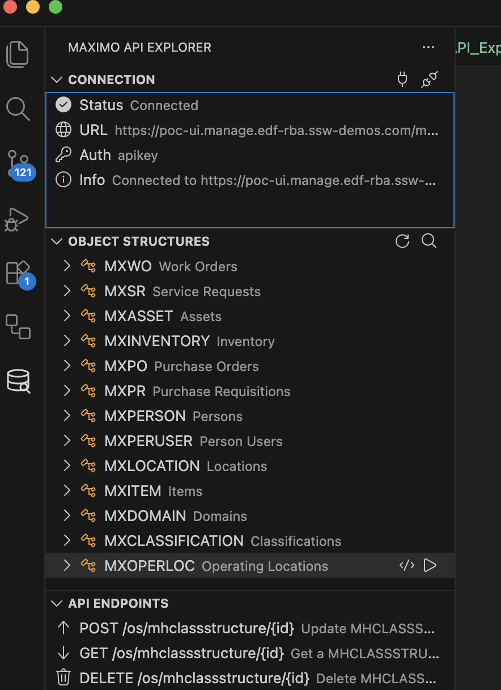
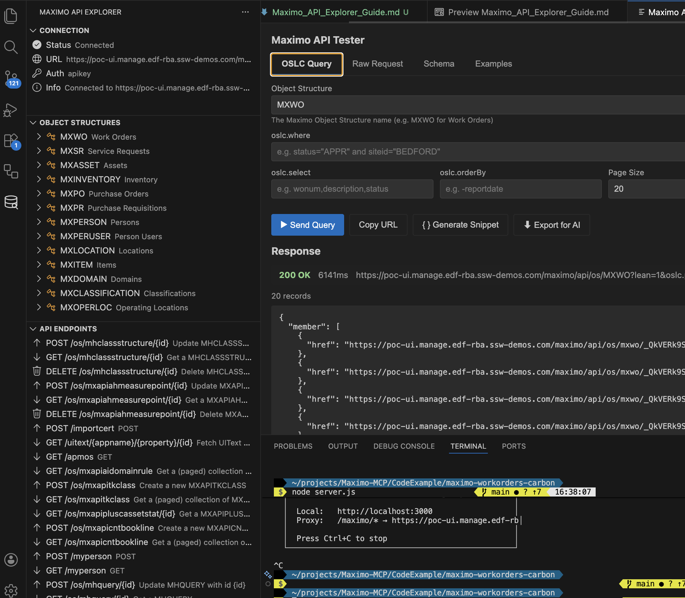
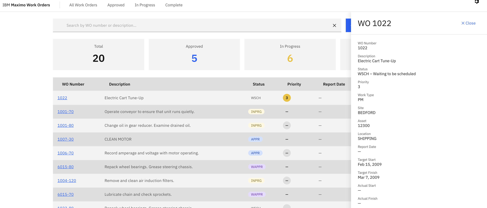
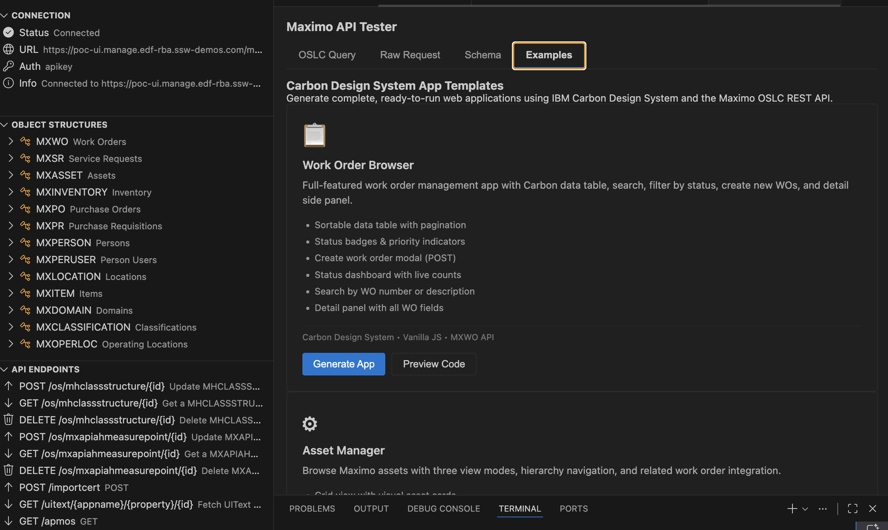

# Maximo API Explorer — VS Code Extension Guide

**Discover, browse, and test IBM Maximo REST APIs directly from VS Code.**

Maximo API Explorer is a Visual Studio Code extension designed for Maximo developers who build applications using the Maximo OSLC/REST API. Unlike MCP-based tools that require an AI agent, this extension works directly in your VS Code sidebar — no AI assistant needed.

**Author:** Markus van Kempen  
**Version:** 0.4.0  
**License:** Apache-2.0  
**Repository:** [github.com/markusvankempen/maximo-mcp-ai-integration-options](https://github.com/markusvankempen/maximo-mcp-ai-integration-options)

---

## Table of Contents

1. [Overview](#overview)
2. [Installation](#installation)
3. [Connecting to Maximo](#connecting-to-maximo)
4. [Sidebar — Browsing Object Structures](#sidebar--browsing-object-structures)
5. [API Tester — Interactive Query Builder](#api-tester--interactive-query-builder)
6. [Code Snippet Generation](#code-snippet-generation)
7. [Carbon App Generator](#carbon-app-generator)
8. [Export for AI Agents](#export-for-ai-agents)
9. [Cursor Extension (AI-Enhanced)](#cursor-extension-ai-enhanced)
10. [Commands Reference](#commands-reference)
11. [Settings Reference](#settings-reference)
12. [Troubleshooting](#troubleshooting)
13. [Architecture](#architecture)

---

## Overview

The Maximo API Explorer provides a complete development workflow for Maximo REST APIs without leaving VS Code:

```
Connect → Discover APIs → Browse Schemas → Test Queries → Generate Code → Build Apps
```

### Key Features

| Feature | Description |
|---------|-------------|
| **API Discovery** | Auto-discover all available Object Structures from your Maximo instance |
| **Schema Inspector** | View attribute names, types, max lengths, and descriptions |
| **OSLC Query Builder** | Build queries visually with where, select, orderBy, and pageSize |
| **Raw Request Mode** | Send arbitrary GET/POST/PUT/PATCH/DELETE requests |
| **Code Generation** | Generate API calls in cURL, Python, JavaScript, TypeScript, Java |
| **Carbon App Templates** | Scaffold complete web applications (Work Orders, Assets) |
| **AI Context Export** | Export schemas and docs for Copilot, Cursor, and other AI tools |

### VS Code UI Overview

The extension adds a **Maximo API Explorer** icon to the Activity Bar (left sidebar) with three views:



*The sidebar shows Connection status (URL, auth method), Object Structures tree (MXWO, MXSR, MXASSET, etc.), and API Endpoints with REST operations.*

---

## Installation

### From Source (Development)

```bash
# Clone the repository
git clone https://github.com/markusvankempen/maximo-mcp-ai-integration-options.git
cd maximo-mcp-ai-integration-options/maximo-api-explorer

# Install dependencies and compile
npm install
npm run compile

# Launch in Extension Development Host
# Press F5 in VS Code
```

### From VSIX Package

```bash
# Build the package
cd maximo-api-explorer
npm run compile
npx vsce package

# Install
code --install-extension maximo-api-explorer-0.3.0.vsix
```

### Prerequisites

- **VS Code** 1.90.0 or later
- **Node.js** 20.x (for development)
- **Maximo Instance** with REST API enabled
- **API Key** or credentials with read access

---

## Connecting to Maximo

### Step 1: Open the Extension

Click the **Maximo API Explorer** icon in the Activity Bar or open the Command Palette (`⇧⌘P`) and run:

```
Maximo: Connect to Instance
```

### Step 2: Enter Connection Details

The extension prompts for:

1. **Base URL** — Your Maximo REST API base URL  
   Example: `https://your-host.com/maximo`

2. **Authentication Method** — Choose one:
   - **API Key** (recommended) — Header-based `apikey` authentication
   - **Basic Auth** — Username/password with Base64 encoding
   - **OAuth 2.0** — Bearer token authentication

3. **Credentials** — API key, or username + password

### Step 3: Test Connection

The extension tests your connection automatically and displays the result:

- **Success** → The sidebar populates with discovered Object Structures
- **Failure** → Options to Retry, Edit Settings, or Disable SSL Verification

### Credential Storage

All credentials are stored securely in VS Code's encrypted **SecretStorage** — they never appear in plain text in settings or config files.

---

## Sidebar — Browsing Object Structures

Once connected, the **Object Structures** view displays all available APIs:

### Tree View Features

- **Search** — Click the 🔍 icon to filter by name or description (e.g., "work order", "asset")
- **Expand** — Click any Object Structure to see its attributes, types, and relationships
- **Right-click** — Context menu with quick actions:

| Action | Description |
|--------|-------------|
| View Attributes | Open the Schema tab with full attribute details |
| Test Endpoint | Open the API Tester panel pre-filled with this OS |
| Generate Code Snippet | Create API call code in your chosen language |
| Copy Endpoint URL | Copy the full REST endpoint URL to clipboard |
| Export for AI Agent | Export this OS with schema + snippets |

### Common Object Structures

| Object Structure | Description |
|-----------------|-------------|
| **MXWO** | Work Orders |
| **MXASSET** | Assets |
| **MXSR** | Service Requests |
| **MXINVENTORY** | Inventory |
| **MXPERSON** | People |
| **MXLOCATION** | Locations |

---

## API Tester — Interactive Query Builder

The API Tester is a full-featured WebView panel with four tabs:



*Query MXWO with visual fields for oslc.where, oslc.select, oslc.orderBy and pageSize. The response shows 200 OK with formatted JSON.*

### OSLC Query Tab

Build parameterized queries with a visual form:

| Field | Description | Example |
|-------|-------------|---------|
| **Object Structure** | Target API | `MXWO` |
| **oslc.where** | Filter condition | `status="APPR" and siteid="BEDFORD"` |
| **oslc.select** | Fields to return | `wonum,description,status,reportdate` |
| **oslc.orderBy** | Sort order (prefix `-` for DESC) | `-reportdate` |
| **oslc.pageSize** | Records per page | `10` |

Click **Send Request** to execute. The response panel shows:
- HTTP status code and timing
- Record count
- Formatted JSON response
- Option to generate a code snippet from this query

### Raw Request Tab

Send freeform HTTP requests:
- Method: GET, POST, PUT, PATCH, DELETE
- Custom headers
- Request body (JSON)
- Full response with headers

### Schema Tab

Inspect Object Structure attributes:
- Attribute name, type, max length
- Required/optional flags
- Persistent/non-persistent indicators
- Child relationships and references

### Examples Tab

Browse and generate Carbon Design System app templates:
- **Work Order Browser** — Click to generate
- **Asset Manager** — Click to generate
- Preview code before exporting

---

## Code Snippet Generation

Generate ready-to-use API call code from any query:

### Supported Languages

| Language | Details |
|----------|---------|
| **cURL** | Shell command with all headers |
| **Python** | Using `requests` library |
| **JavaScript** | Using `fetch` API |
| **TypeScript** | With typed response interfaces |
| **Java** | Using `HttpClient` (Java 11+) |

### How to Generate

1. **From the sidebar** — Right-click any Object Structure → Generate Code Snippet
2. **From the API Tester** — Click `{ } Generate Snippet` after running a query
3. **Command Palette** — `Maximo: Generate Code Snippet` or `Maximo: Insert API Snippet at Cursor`

### Example Output (Python)

```python
import requests

url = "https://your-host.com/maximo/api/os/MXWO"
headers = {"apikey": "YOUR_API_KEY", "Content-Type": "application/json"}
params = {
    "oslc.where": 'status="APPR" and siteid="BEDFORD"',
    "oslc.select": "wonum,description,status",
    "oslc.orderBy": "-reportdate",
    "oslc.pageSize": "10",
    "lean": "1"
}

response = requests.get(url, headers=headers, params=params)
data = response.json()

for record in data.get("member", []):
    print(record["wonum"], record["description"])
```

---

## Carbon App Generator

Generate complete, self-contained web applications using the IBM Carbon Design System.



*20 work orders loaded with Carbon Design System styling, status badges, priority indicators, and a detail panel for WO 1022.*

### Available Templates

#### Work Order Browser

A full-featured work order management UI:

| Feature | Description |
|---------|-------------|
| Sortable Data Table | Carbon data table with column sorting |
| Status Badges | Color-coded status indicators (APPR, INPRG, COMP, etc.) |
| Priority Indicators | Visual priority levels (1–4) |
| Search | Search by WO number (exact) or description (text) |
| Status Filter | Quick filter by Approved, In Progress, Complete |
| Create Work Order | Modal form for creating new WOs via POST |
| Detail Panel | Side panel with all work order fields |
| Pagination | Navigate through pages of results |
| Stats Dashboard | Tiles showing counts by status |

#### Asset Manager

A multi-view asset browser:

| Feature | Description |
|---------|-------------|
| Grid View | Visual card layout for browsing assets |
| Table View | Classic sortable data table |
| Hierarchy View | Expandable parent-child tree navigation |
| Search & Filter | Search by asset number or description, filter by status |
| Detail Panel | Full asset details with related work orders |
| Status Dashboard | Asset counts by status |

### How to Generate

1. **Command Palette** → `Maximo: Generate Carbon App`
2. Choose **Work Order Browser** or **Asset Manager**
3. Select a target folder
4. The extension generates 6 files:

| File | Purpose |
|------|---------|
| `index.html` | Main page with Carbon Design System layout |
| `styles.css` | Carbon-themed styles, status badges, responsive layout |
| `app.js` | Maximo API integration, CRUD, search, pagination |
| `server.js` | Node.js CORS proxy server (zero dependencies) |
| `package.json` | npm scripts for running the proxy |
| `README.md` | Quick start guide and documentation |

### Running the Generated App

```bash
cd maximo-workorders-carbon   # or maximo-assets-carbon

# Set your Maximo target (optional, defaults to demo instance)
export MAXIMO_TARGET=https://your-maximo-host.com

# Start the proxy server
npm start

# Open in browser
open http://localhost:3000
```

The proxy server serves the static files and forwards `/maximo/*` requests to the real Maximo host, avoiding CORS restrictions.

---

## 7.5 Live Seed & Scaffold

The **Live Seed & Scaffold** feature allows you to pick **any Object Structure** (e.g. `MXWO`, `MXASSET`, `MXSR`, `MXLABOR`), execute a live OSLC query to fetch real records, and instantly package them into a self-contained HTML/JS app pre-populated with live seed data.

### Features
- **Any Object Structure**: Works with standard or custom Maximo Object Structures.
- **Data-Driven Columns**: Dynamic data table auto-generated from returned fields.
- **Offline Capable**: Seed data is embedded directly as a JSON literal in `index.html` — zero API calls required at runtime.
- **Interactive Capabilities**: Built-in client-side search across all fields, column sorting, slide-in row detail panel, and CSV export.
- **3 Color Themes**: Dark (IBM Carbon), Light, and IBM Blue.

### How to Use

1. **Full Wizard** (`Maximo: Live Seed & Scaffold` via Command Palette or `$(zap)` icon on Object Structures sidebar):
   - Step 1: Select or type an Object Structure name.
   - Step 2: Enter an optional `oslc.where` filter (e.g., `status="APPR"`).
   - Step 3: Enter optional comma-separated fields to include.
   - Step 4: Choose record count (5, 10, 20, or 50).
   - Step 5: Select theme (Dark, Light, or IBM Blue).

2. **Quick Seed** (Right-click any Object Structure item in the tree view → **Quick Seed & Scaffold**):
   - Uses defaults: 10 records, all fields, Dark theme.

---

## Export for AI Agents

Export Maximo API schemas and documentation for use with AI assistants like Copilot, Cursor, or Windsurf.

### Full Project Export

Command: `Maximo: Export Project Context for AI`

Creates a `.maximo/` directory in your workspace:

```
.maximo/
├── AI_CONTEXT.md              — Overview for AI assistants
├── schemas/
│   ├── MXWO.json              — Work Order schema
│   ├── MXASSET.json           — Asset schema
│   └── ...
├── endpoints/
│   └── endpoints.json         — All API endpoint URLs
├── snippets/
│   ├── MXWO.py                — Python example
│   ├── MXWO.js                — JavaScript example
│   └── ...
└── docs/
    └── oslc-reference.md      — OSLC query syntax guide
```

### Single OS Export

Right-click any Object Structure in the sidebar → **Export for AI Agent**

Exports just that one OS with its schema and snippets.

### Usage with AI

Reference the exported files in your AI prompts:
- In **Copilot**: Open `AI_CONTEXT.md` in a tab for automatic context
- In **Cursor**: Use `@file .maximo/schemas/MXWO.json` in chat
- In **Windsurf**: Reference the `.maximo/` directory in prompts

---

## Cursor Extension (AI-Enhanced)

The **Maximo Cursor Explorer** (`maximo-cursor-extension/`) is a fork of the API Explorer with additional features for [Cursor](https://cursor.com):

### Additional Features

| Feature | Description |
|---------|-------------|
| **.cursorrules Generator** | Auto-generate a `.cursorrules` file with deep Maximo API knowledge |
| **AI Context Export** | Export to `.cursor/context/` and `.cursor/prompts/` directories |
| **Prompt Templates** | Pre-built prompts for queries, CRUD services, dashboards, tests |
| **Cursor AI Tab** | Dedicated tab in the API Tester WebView |

### .cursorrules Contents

The generated `.cursorrules` file teaches Cursor AI about:
- Maximo OSLC REST API patterns and URL structure
- Object Structure schemas and attributes
- Query syntax (`oslc.where`, `oslc.select`, `oslc.orderBy`)
- Authentication methods (API Key, Basic, OAuth)
- Response formats and error codes
- Best practices for Maximo development

### Installation

```bash
cd maximo-cursor-extension
npm install && npm run compile
# Press F5 to launch in Extension Development Host
```

---

## Commands Reference

| Command | Description |
|---------|-------------|
| `Maximo: Connect to Instance` | Set up connection and credentials |
| `Maximo: Disconnect` | Clear connection and credentials |
| `Maximo: Refresh Object Structures` | Re-discover available APIs |
| `Maximo: Search Object Structures` | Filter the Object Structures list |
| `Maximo: Test API Endpoint` | Open the interactive API Tester |
| `Maximo: Generate Code Snippet` | Generate API call code in chosen language |
| `Maximo: Insert API Snippet at Cursor` | Generate and insert code at cursor position |
| `Maximo: Generate Carbon App` | Scaffold a Carbon Design System application |
| `Maximo: Preview App Template Code` | View generated code before exporting |
| `Maximo: Live Seed & Scaffold` | 5-step wizard to seed live data into a web app |
| `Maximo: Quick Seed & Scaffold` | One-click seed & scaffold with default options |
| `Maximo: Export Project Context for AI` | Export schemas & docs for AI agents |
| `Maximo: Export Object Structure` | Export a single OS with schema + snippets |
| `Maximo: Open Swagger UI` | Open Maximo's Swagger documentation |

---

## Settings Reference

Configure via **File → Preferences → Settings** → search "Maximo":

| Setting | Default | Description |
|---------|---------|-------------|
| `maximoExplorer.url` | `""` | Base URL for Maximo (e.g., `https://host/maximo`) |
| `maximoExplorer.authMethod` | `"apikey"` | Auth method: `apikey`, `basic`, or `oauth` |
| `maximoExplorer.lean` | `true` | Use lean responses (simplified JSON) |
| `maximoExplorer.defaultPageSize` | `20` | Default records per page |
| `maximoExplorer.sslVerify` | `true` | Verify SSL certificates |

---

## Troubleshooting

### Connection Issues

| Problem | Solution |
|---------|----------|
| **SSL Certificate Error** | Disable SSL verification: Settings → `maximoExplorer.sslVerify` → `false` |
| **401 Unauthorized** | Verify your API key or credentials. Try regenerating the API key in Maximo. |
| **404 Not Found** | Check the base URL. It should be `https://host/maximo` (no trailing `/api`). |
| **CORS Errors** | This extension runs in VS Code (Node.js), not a browser — CORS does not apply. |

### Generated App Issues

| Problem | Solution |
|---------|----------|
| **CORS in browser** | Use the included `server.js` proxy: `npm start` |
| **Search returns no results** | Maximo descriptions are often uppercase. The app auto-uppercases search terms. |
| **400 Bad Request on search** | The app uses single-field OSLC queries (no `or` between fields). Check the search term. |
| **502 Proxy Error** | The Maximo server may be unreachable. Check `MAXIMO_TARGET` in your environment. |

### Extension Not Activating

1. Check the Output panel: **View → Output** → select "Maximo API Explorer"
2. Ensure VS Code version is 1.90.0 or later
3. Try reloading: `⇧⌘P` → `Developer: Reload Window`

---

## Architecture

The extension communicates directly with your Maximo instance's REST API — no MCP server or AI agent dependency.

```
┌──────────────────────────────────────────────┐
│  VS Code                                      │
│  ┌──────────────────────────────────────────┐ │
│  │  Maximo API Explorer Extension           │ │
│  │                                          │ │
│  │  ┌────────────┐  ┌────────────────────┐  │ │
│  │  │  Sidebar    │  │  API Tester Panel  │  │ │
│  │  │  TreeView   │  │  (WebView)         │  │ │
│  │  │  ─ Connect  │  │  ─ OSLC Query      │  │ │
│  │  │  ─ OS List  │  │  ─ Raw Request     │  │ │
│  │  │  ─ Endpoints│  │  ─ Schema          │  │ │
│  │  └─────┬───────┘  │  ─ Examples        │  │ │
│  │        │          └────────┬───────────┘  │ │
│  │        └──────┬────────────┘              │ │
│  │        ┌──────┴────────┐                  │ │
│  │        │ MaximoClient  │  API calls       │ │
│  │        │ AuthManager   │  Credentials     │ │
│  │        │ ApiDiscovery  │  Schema cache    │ │
│  │        │ AppGenerator  │  Carbon apps     │ │
│  │        │ SnippetGen    │  Code output     │ │
│  │        │ Exporter      │  AI context      │ │
│  │        └──────┬────────┘                  │ │
│  └───────────────┼──────────────────────────┘ │
└──────────────────┼────────────────────────────┘
                   │ HTTPS
          ┌────────┴──────────┐
          │  Maximo Server     │
          │  OSLC REST API     │
          └───────────────────┘
```

### Source Code Structure

```
maximo-api-explorer/
├── src/
│   ├── extension.ts           # Activation, command registration
│   ├── api/
│   │   ├── maximoClient.ts    # HTTP client for Maximo REST API
│   │   └── apiDiscovery.ts    # Object Structure discovery & caching
│   ├── auth/
│   │   └── authManager.ts     # Credential prompts & SecretStorage
│   ├── views/
│   │   ├── treeProvider.ts    # Sidebar tree data providers
│   │   ├── treeItems.ts       # Tree item models
│   │   └── endpointPanel.ts   # WebView panel (API Tester)
│   ├── snippets/
│   │   └── snippetGenerator.ts # Multi-language code generation
│   ├── templates/
│   │   ├── appGenerator.ts    # Template picker & file writer
│   │   ├── carbonWorkOrders.ts # Work Order app template
│   │   └── carbonAssets.ts    # Asset Manager app template
│   ├── export/
│   │   └── projectExporter.ts # AI context export (.maximo/)
│   └── utils/
│       └── constants.ts       # Shared constants
├── media/
│   ├── icon.png               # Extension icon
│   └── maximo-icon.svg        # Activity bar icon
├── package.json               # Extension manifest & contributions
└── tsconfig.json              # TypeScript configuration
```

---

## Screenshots

### Sidebar — Connection & Object Structures


*The Maximo API Explorer sidebar showing a live connection to a Maximo instance. The Connection section displays status, URL, and auth method. The Object Structures tree lists all discovered APIs (MXWO, MXSR, MXASSET, MXINVENTORY, etc.) with refresh and search icons. The API Endpoints section shows available REST operations.*

### API Tester — OSLC Query Builder & JSON Response


*The interactive API Tester panel with the OSLC Query tab active. A query against MXWO returned 200 OK in 6141ms with 20 records. The response panel shows the JSON output with member HREFs. Tabs for Raw Request, Schema, and Examples are available at the top. The terminal below shows the local proxy server running on port 3000.*

### Carbon App Templates — Examples Tab



*The Examples tab in the API Tester showing Carbon Design System App Templates. Two templates are available: **Work Order Browser** (with sortable data table, status badges, CRUD, search, and detail panel) and **Asset Manager** (with grid, table, and hierarchy views). Click "Generate App" to scaffold a complete project or "Preview Code" to inspect the output first.*

### Generated Carbon App — Work Order Browser


*A complete Work Order Browser application generated by the extension. Shows 20 work orders loaded from a live Maximo instance with IBM Carbon Design System styling. Features include status badges (WSCH, INPRG, APPR, WAPPR), priority indicators, a detail side panel showing WO 1022 with full field information, and stats tiles showing counts by status.*

---

*Documentation for the [Maximo MCP AI Integration Options](https://github.com/markusvankempen/maximo-mcp-ai-integration-options) project.*
