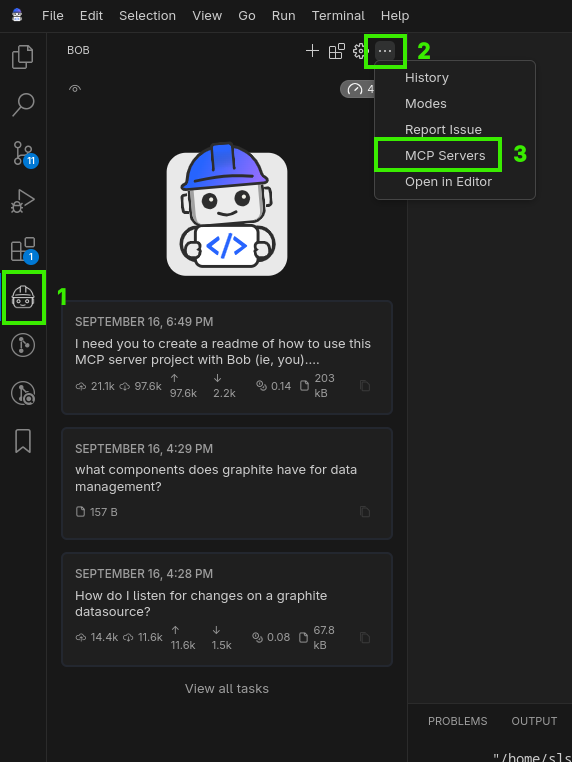
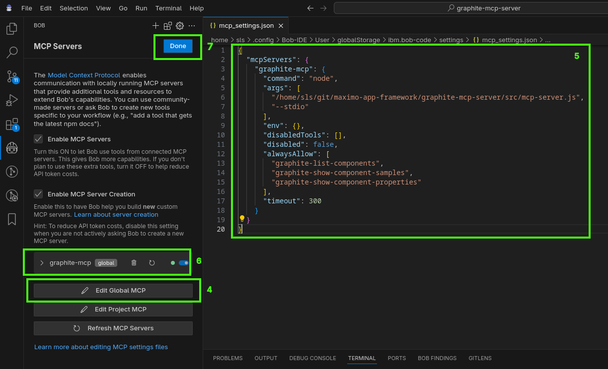

# Graphite MCP Server

A Model Context Protocol (MCP) server for AI assistants, specifically designed to work with Bob (IBM's AI assistant) for Graphite application development.

This server is provided as a proof of concept.  The hope is that other devs will continue to tweak the guides, prompts, tools, etc.

## Overview

This MCP server provides specialized tools and resources for developing Graphite applications with Bob. It enables Bob to:

- Access documentation on Graphite controllers, state management, and unit testing
- Generate controller templates for different component types (App, Page, Data)
- List available Graphite components and their properties
- Show component samples and usage examples

## Installation

### Prerequisites

- Node.js (v20 or higher)
- Yarn

### Setup Steps

1. Clone the repository:
   ```bash
   git clone https://github.ibm.com/maximo-app-framework/graphite-mcp-server.git
   cd graphite-mcp-server
   ```

2. Install dependencies:
   ```bash
   yarn install
   ```

## Configuring Bob to Use This MCP Server

To use this MCP server with Bob, you need to configure Bob's MCP settings. The configuration file is typically located at:

```
~/.config/Bob-IDE/User/globalStorage/ibm.bob-code/settings/mcp_settings.json
```

Another location (from Mac OS):

```
~/Library/Application\ Support/Bob-IDE/User/globalStorage/ibm.bob-code/settings/mcp_settings.json 
```

### Basic Configuration

```json
{
  "mcpServers": {
    "graphite-mcp": {
      "command": "node",
      "args": [
        "{path to graphite-mcp-server}/src/mcp-server.js",
        "--stdio"
      ],
      "env": {
        "MAXIMO_MCP_URL": "http://localhost:9080",
        "MAXIMO_MCP_USER": "maximo username",
        "MAXIMO_MCP_PASSWORD": "maximo password. Can be omitted if user/pass is the same"
      },
      "disabledTools": [],
      "disabled": false,
      "alwaysAllow": [
        "graphite-list-components",
        "graphite-show-component-samples",
        "graphite-show-component-properties"
      ],
      "timeout": 300
    }
  }
}
```


### Configuration with RAG Support

To enable RAG (Retrieval Augmented Generation) support, add the `--rag` flag and RAG service parameters to the above config:

```json
{
  "mcpServers": {
    "graphite-mcp": {
      "command": "node",
      "args": [
        "{path to graphite-mcp-server}/src/mcp-server.js",
        "--stdio",
        "--rag",
        "--rag-host", "9.30.231.84",
        "--rag-token", "your-auth-token-here. read below for instructions."
      ],
      "env": {
        "MAXIMO_MCP_URL": "http://localhost:9080",
        "MAXIMO_MCP_USER": "maximo username",
        "MAXIMO_MCP_PASSWORD": "maximo password. Can be omitted if user/pass is the same"
      },
      "disabledTools": [],
      "disabled": false,
      "alwaysAllow": [
        "graphite-list-components",
        "graphite-show-component-samples",
        "graphite-show-component-properties",
        "list-rag-indexes",
        "retrieve-specific-examples-and-documentation"
      ],
      "timeout": 300
    }
  }
}
```

**RAG Configuration Parameters:**
- `--rag`: Enable RAG tools and resources
- `--rag-host`: RAG service hostname (9.30.231.84)
- `--rag-token`: Authorization token for RAG service ([Generate token here](https://9.30.231.84/auth/) )


NOTE: update the path of `mcp-server.js` to be the path of the server on your machine.

NOTE: you only need to the `MAXIMO_MCP_*` environments variables IF you want to integrate with your local maximo server to query information about `objectstructures`.  Note, at APIKEY support is not yet enabled, but someone could add support for that.

### Visual configuration walkthrough

* 1 - Click Bob
* 2 - Click 3 dot menu
* 3 - Click "MCP Servers"


* 4 - Click "Edit Global MCP"
* 5 - Paste/Merge the `mcpServers` configuration from above
* 6 - When you save you should see `graphite-mcp server entry
* 7 - Click "Done"

## Configuring Bob's Graphite Mode

To get the most out of this MCP server, you should configure a custom "Graphite" mode in Bob. This mode provides Bob with specialized knowledge and workflows for Graphite development.

For detailed instructions on setting up the Graphite mode, see [GRAPHITE_MODE.md](./docs/GRAPHITE_MODE.md).

Once configured, switch to the Graphite mode when working on Graphite projects to get specialized assistance.

## Sample Prompts for Testing

Here are some sample prompts you can use with Bob to test that the MCP server is working correctly:

### List Graphite Components

```
Can you list all available Graphite components?
```

### Get Component Samples

```
Show me samples for the button component in Graphite.
```

### Add xml

```
Add a new page to @app.xml that includes 3 tabs, for 'Quick start', 'Details', and 'More info'.
```

### Search for an object structure

```
What objectstructure should I use if I want to get basic information about a work orders?
```

### Automatically build a datasource
```
Create a maximo-datasource with the required and suggested fields for the MXAPIWO object structure
```

## Resources

For more information on using MCP in Bob, visit:
https://pages.github.ibm.com/code-assistant/bob-docs/features/mcp/using-mcp-in-bob/
